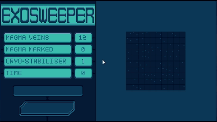

# Exosweeper
*A minesweeper clone built with C and raylib*

A small minesweeper game built in 2025 as part of university coursework with custom art, a new cryo-stabiliser ability and 3 different grids to choose from.

Exosweeper is a space-themed minesweeper game where you use the mouse to mark and avoid lava (mines) and harvest ore (non-mines).
Collecting all of the ore on the map wins the game and revealing lava, causes a loss.

[Demo Video](https://www.youtube.com/watch?v=dg9d5L1v2qQ)

[Full Playthrough Video](https://www.youtube.com/watch?v=iF-4iNuu4JQ)

## Features
- Mouse-controlled marking and revealing
- Main menu for navigation
- Three grid sizes: 10 x 10, 15 x 15 and 20 x 20
- Each grid is randomly generated, offering infinite grid possibilities
- A HUD to display all relevant information
- New cryo-stabiliser ability, where the player can freeze a lava space turning it into a regular space
- Music for both the menu and the game
- Sound effects used for different actions
- Custom pixel art created for this game

## Controls
- Left-click to reveal a square
- Right-click to mark a square as lava
- Shift + left-click to use the cryo-stabiliser ability

## Installation
**Option 1: Play instantly**
- [Download the game on Itch.io](https://rosenrgd.itch.io/Exosweeper)

**Option 2: Run locally**
1. Clone this repository  
2. Install raylib
3. Compile
4. Run the Exosweeper executable

## Built With
- 
- 

## Credits
- **Game design & programming:** Evan Jarvis  
- **Pixel art:** Evan Jarvis  
- **Menu music:** [Harán](https://opengameart.org/content/har%C3%A1n)
- **Gameplay music:** [Continue](https://opengameart.org/content/continue)
- **Sound effects:** [8-bit Sound Effects Pack](https://opengameart.org/content/512-sound-effects-8-bit-style)

